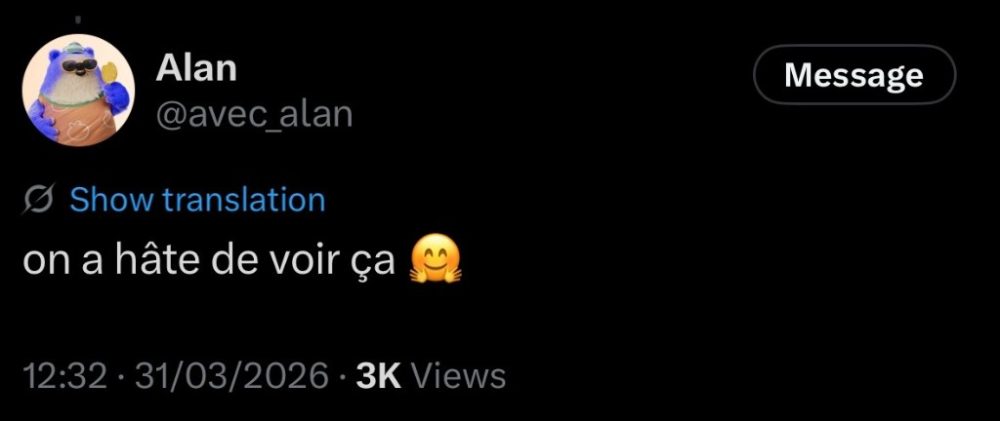
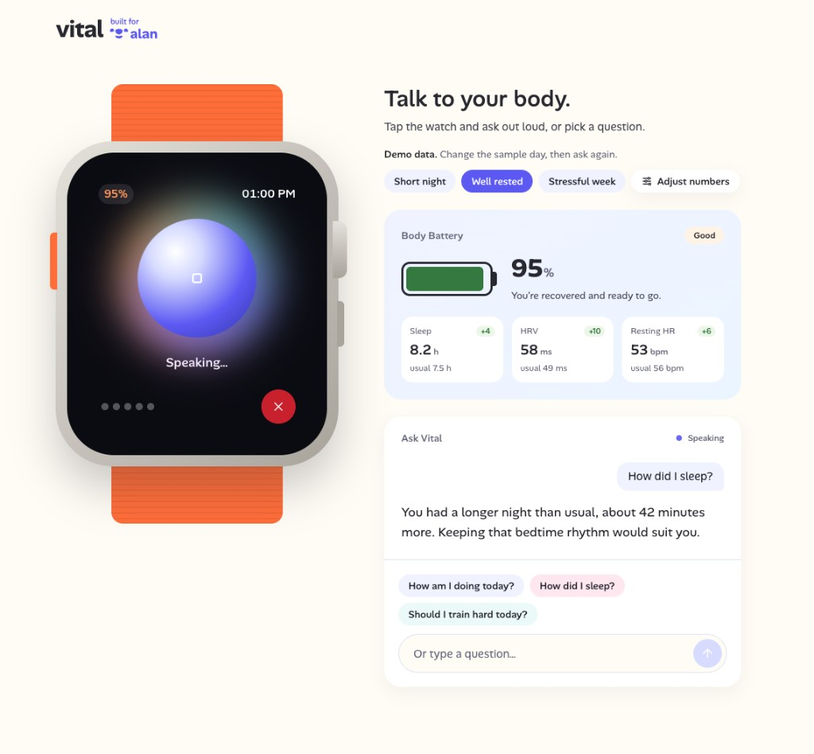

<h1 align="center">Vital</h1>

<p align="center">
  <em>Talk to your body.</em>
</p>

> Built for the [**Alan × Mistral AI Health Hack**](https://luma.com/t7rspaka) — April 11, 2026, Paris.

<table border="0" cellspacing="0" cellpadding="0"><tr>
  <td align="center" valign="middle"></td>
  <td align="center" valign="middle"><a href="https://luma.com/t7rspaka"></a></td>
</tr></table>

<p align="left">
  <a href="https://vital.dhicham-pro.workers.dev"><b>Give it a try →</b></a>
</p>

<p align="center">
  
</p>

<p align="left">
  
  
  
  
  <br><br>
  <a href="https://mistral.ai"></a>
  <a href="https://www.apple.com/health/"></a>
</p>

---

## Quick start

Requires Node.js 22+, pnpm 10+ (`corepack enable`) and an [OpenRouter API key](https://openrouter.ai/keys).

```bash
git clone https://github.com/vitalvie/vital.git && cd vital
pnpm install
cp apps/web/.env.example apps/web/.env   # then set OPENROUTER_API_KEY
pnpm dev
```

Open [http://localhost:3000](http://localhost:3000). Tap the watch, or pick a question. The mic works on `localhost` or HTTPS; otherwise, type a question. The app opens on a well-rested sample day.

### Change the mocked data

Under the title, pick **Short night**, **Well rested** or **Stressful week**, or click **Adjust numbers** and move the sliders for last night's sleep, HRV and resting heart rate. Vital answers with those numbers.

To change the 14-day history or the presets, edit [`apps/web/src/data/mock-health.ts`](apps/web/src/data/mock-health.ts), then update the expected scores in the tests so `pnpm test` stays green.

## License

[AGPL-3.0](LICENSE)

---
