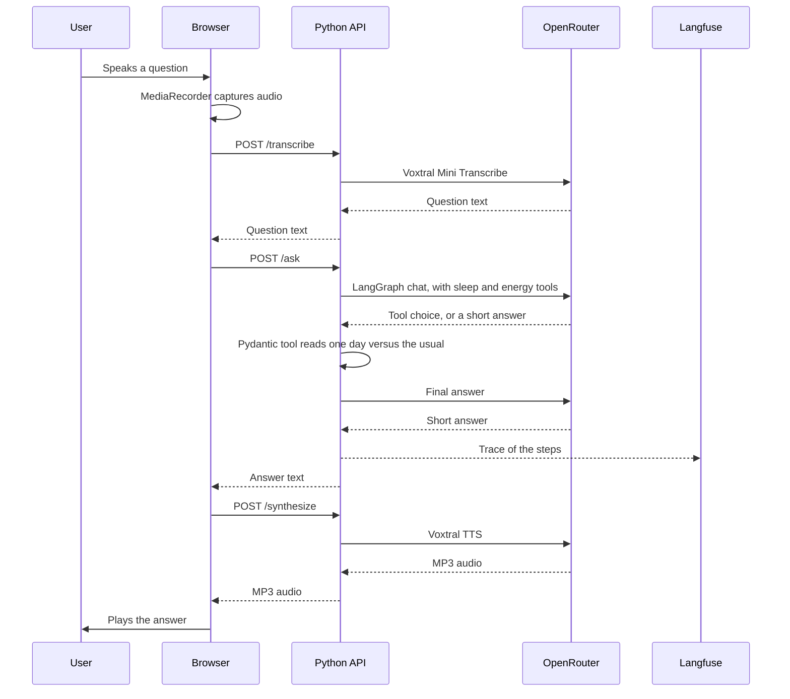

## Repository layout

```
apps/
  web/                 TanStack Start app (React + TypeScript)
    src/
      components/      UI components (Watch, Orb, BodyBatteryCard, Conversation, AskBar, DemoDataPanel, Logo, icons)
      data/            Mocked HealthKit data, demo presets
      lib/             Body Battery score, audio helpers, client for the API
      server/          Release footer
      routes/          Pages (file-based routing)
  api/                 FastAPI (Python). LangGraph, Pydantic tools, Voxtral speech
docs/                  This Mintlify site
public/                Static assets used by the README
```

The page head includes Open Graph and Twitter tags so a shared link previews the app. The image is `apps/web/public/og.png`.

The repo is a pnpm workspace. New apps go under `apps/`.

## Request flow



## Decisions

- **Python API.** FastAPI in `apps/api` keeps the OpenRouter key off the browser. Pydantic validates the `sleep` and `energy` tool inputs. The React app calls it at `VITE_API_URL` (default `http://127.0.0.1:8000`).
- **Mistral through OpenRouter.** Voxtral for speech in and out, Mistral chat for the answer, all via `https://openrouter.ai/api/v1`. The answer is a short LangGraph loop: the model may call `sleep` or `energy`, and the API returns one day's summary, not the 14-day history.
- **Mocked data.** Browsers can't read HealthKit, so the data is synthetic but shaped like HealthKit types.
- **Alan-inspired design system.** Alan Sans, pastel tokens, and a voice orb as the main control. See [Design system](/design-system).
- **Server builds the context.** The client sends the question, three demo values, and the previous turn if there is one. The server clamps them, loads the rest of the data itself, and applies the guardrails in [Safety and evals](/safety).
- **Cloudflare Workers.** The web app and the release footer deploy to Workers. Chat, transcription and speech run in the Python API, which `pnpm dev` starts locally. The Worker deploy does not host that API.

## Environment variables

| Variable | Required | Default |
|----------|----------|---------|
| `OPENROUTER_API_KEY` | Yes | |
| `OPENROUTER_MODEL` | No | `mistralai/mistral-small-3.2-24b-instruct` |
| `VOXTRAL_VOICE` | No | `gb_jane_neutral` |
| `LANGFUSE_PUBLIC_KEY` | No | |
| `LANGFUSE_SECRET_KEY` | No | |
| `LANGFUSE_BASE_URL` | No | `https://cloud.langfuse.com` |
| `TYPESAFE_API_KEY` | Evals only | |
| `JEV_MODEL` | No | `jev-latest` |
| `VITE_API_URL` | No | `http://127.0.0.1:8000` |

Set them in `apps/web/.env` locally. The Python API reads that file. `VITE_API_URL` is read by the browser build. `TYPESAFE_API_KEY` is only for `pnpm eval` and CI. Never commit `.env`.
