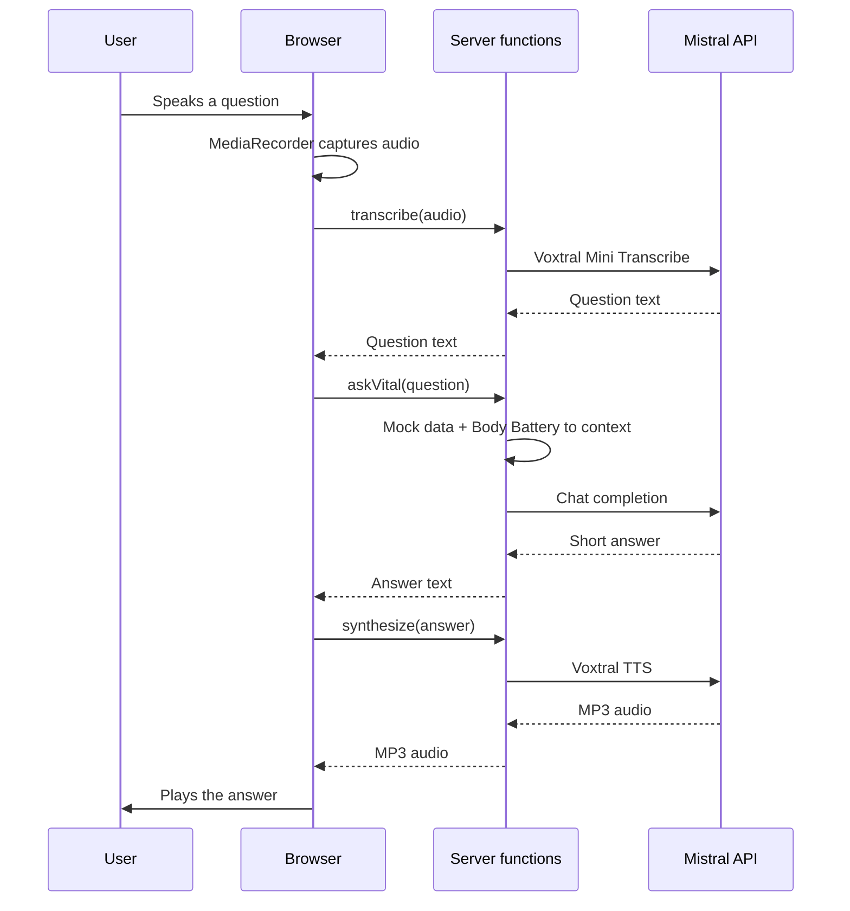

## Repository layout

```
apps/
  web/                 TanStack Start app (React + TypeScript)
    src/
      components/      UI components (Watch, Orb, BodyBatteryCard, Conversation, AskBar, Logo, icons)
      data/            Mocked HealthKit data
      lib/             Body Battery score, audio record/playback helpers
      server/          Server functions (Mistral SDK: chat, Voxtral STT and TTS)
      routes/          Pages (file-based routing)
docs/                  This Mintlify site
public/                Static assets used by the README
```

The repo is a pnpm workspace. New apps go under `apps/`.

## Request flow



## Decisions

- **No separate backend.** TanStack Start server functions keep the Mistral key on the server, with no extra service to run.
- **Mistral end to end.** Voxtral for speech in and out, Mistral chat for the answer, all through the official SDK.
- **Mocked data.** Browsers can't read HealthKit, so the data is synthetic but shaped like HealthKit types.
- **Alan-inspired design system.** Alan Sans, pastel tokens, and a voice orb as the main control. See [Design system](/design-system).
- **Server builds the context.** The client only sends the question. The server loads the data itself.
- **Cloudflare Workers.** `@cloudflare/vite-plugin` runs dev, preview and production in the Workers runtime. `@opentelemetry/api` is installed only because the Mistral SDK imports it and Workers bundle everything.

## Environment variables

| Variable | Required | Default |
|----------|----------|---------|
| `MISTRAL_API_KEY` | Yes | |
| `MISTRAL_MODEL` | No | `mistral-small-latest` |
| `VOXTRAL_VOICE` | No | `gb_jane_neutral` |

Set them in `apps/web/.env` locally. In production, add them as Worker secrets (`wrangler secret put MISTRAL_API_KEY`). Never commit `.env`.
