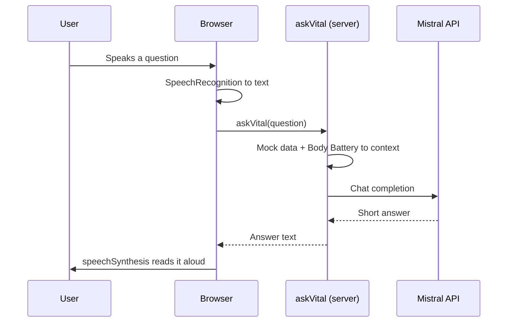

## Repository layout

```
apps/
  web/                 TanStack Start app (React + TypeScript)
    src/
      data/            Mocked HealthKit data
      lib/             Body Battery score, Web Speech helpers
      server/          Server functions (Mistral call)
      routes/          Pages (file-based routing)
docs/                  This Mintlify site
public/                Static assets used by the README
```

The repo is a pnpm workspace. New apps go under `apps/`.

## Request flow



## Decisions

- **No separate backend.** TanStack Start server functions keep the Mistral key on the server, with no extra service to run.
- **Browser voice APIs.** Free, no keys, good enough for a demo.
- **Mocked data.** Browsers can't read HealthKit, so the data is synthetic but shaped like HealthKit types.
- **Alan-inspired design.** Alan Sans font (Google Fonts), cream background, indigo primary, soft gradient cards. Tokens live in `apps/web/src/styles.css`.
- **Server builds the context.** The client only sends the question. The server loads the data itself.

## Environment variables

| Variable | Required | Default |
|----------|----------|---------|
| `MISTRAL_API_KEY` | Yes | |
| `MISTRAL_MODEL` | No | `mistral-small-latest` |

Set them in `apps/web/.env`. Never commit that file.
